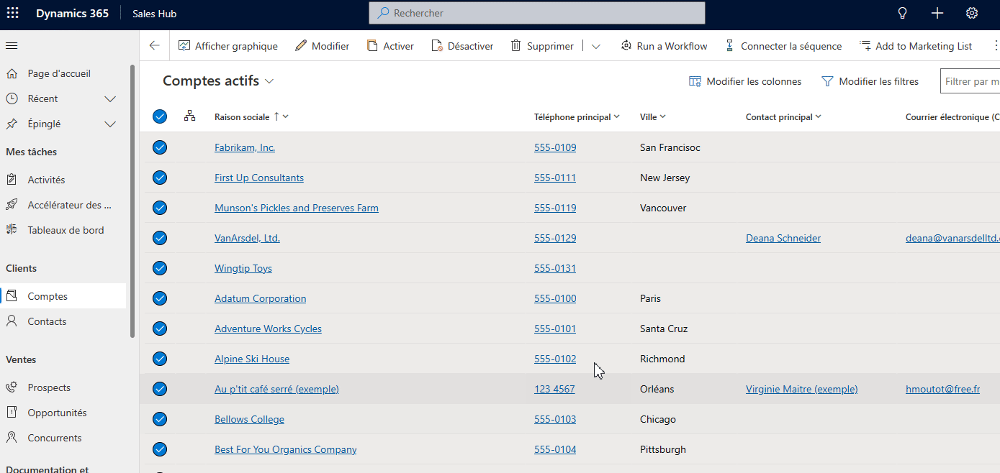

# Dynamics 365 run Workflow button

Recover the feature removed by Microsoft in Dynamics 365 V9.1 On Premise allowing users to run On demand Workflow from Views, Subgrid and Forms.

## Features 

- Available on all views, subgrid and forms
- Open a dialog for choosing an active on demand Workflow to run
- Display a confirmation dialog
- Display a progress dialog with the number of records being processed

## Usage

- Import the managed solution from the release page [Dynamics365RunWorfklowButton_1_0_0_0_managed.zip](https://github.com/michaelsazbon/Dynamics-365-Run-Workflow-Button/releases/tag/Dynamics365RunWorfklowButton_1_0_0_0) 
- Select records
- Click on the button Run a Workflow
